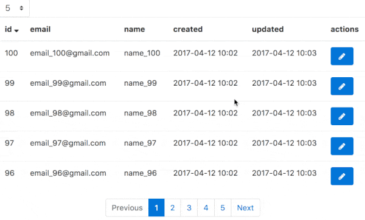

# pagin

A simple pagination library for single page application(SPA).



## Installation

```
npm install --save pagin
```

## Usage

js
```
import Pagin from 'pagin'
var callback = function(params, success, failure) {
    // ajax
}
var pagin = new Pagin(callback)
```

or

```
・・・
var options = {
    rangePages: 7,
    limit: 10,
    recordsKey: 'records',
    totalCountKey: 'totalCount'
}
var pagin = new Pagin(callback, options)
```

## Options

| key           |   default    | description                                                                                                                                                   |
|:--------------|:------------:|:--------------------------------------------------------------------------------------------------------------------------------------------------------------|
| limit         |      5       | A number of items per page.                                                                                                                                   |
| rangePages    |      5       | A number of pages to display.                                                                                                                                 |
| recordsKey    |  'records'   | Path to items in response. If the path does not exist, an empty array is returned. (dot-notation OK. ex.: 'data.records' -> {"data": {"records": [<items>]}}) |
| totalCountKey | 'totalCount' | Path to the total number of items in response. If the path does not exist, 0 is returned. (dot-notation OK)                                                   |
| sort          |     'id'     | The item name to be sorted. It is included in the params passed to the callback.                                                                              |
| order         |    'desc'    | 'asc' or 'desc'. It is included in the params passed to the callback.                                                                                         |

## API

| method/property    | description                             |
|:-------------------|:----------------------------------------|
| pagin.limit        | A number of items per page.             |
| pagin.rangePages   | A number of pages to display.           |
| pagin.currentPage  | A number of current pages.              |
| pagin.isLoading    | true or false. Is it loading?           |
| pagin.sort         | Current sort item name.                 |
| pagin.order        | Current order.                          |
| pagin.records      | Current items.                          |
| pagin.totalCount   | Total number of items.                  |
| pagin.hasPrev()    | Does the previous page exist?           |
| pagin.hasNext()    | Does the next page exist?               |
| pagin.totalPage()  | The total number of pages.              |
| pagin.toPage(num)  | To specified page. num: number of page. |
| pagin.prev()       | To previous page.                       |
| pagin.next()       | To next page.                           |
| pagin.range()      | Range of pages to be displayed.         |
| pagin.sortBy(key)  | Sort by key.                            |
| pagin.orderBy(key) | 'asc' or 'desc' or ''.                  |
